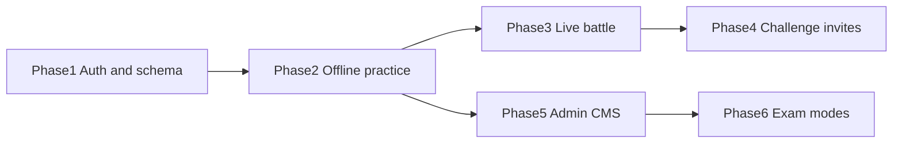

# Battleverse — Step-by-Step Build Plan

**Audience:** founder + implementing engineer  
**Companion docs:** [PRD.md](./PRD.md), [TRD.md](./TRD.md)  
**Rule:** each phase is independently shippable and testable against the **existing** frontend. Do not rewrite the UI. Do not start Phase N+1 until that phase’s definition of done is met.

Effort is **S / M / L** only (no fake hour estimates).

Phase 5 can start after Phase 2 (content must exist to administer). Phase 6 needs Phase 5 tags. Phase 4 needs Phase 3 rooms.

---

## Phase 1 — Backend, auth, data model

**Effort: L**  
**Depends on:** nothing (greenfield backend). Existing UI stays playable with local data until cutover flags.  
**Setup:** [docs/PHASE1.md](./PHASE1.md) — create the Supabase project, run SQL, copy `.env.example` to `.env.local`.

### What gets built

- Supabase project; env `VITE_SUPABASE_URL`, `VITE_SUPABASE_ANON_KEY`.
- Tables + RLS from TRD §5 (`profiles`, `subjects`, `questions`, …).
- Seed: current 32 questions from `src/data/quizData.ts` + four subjects + badges/levels from `src/data/gameData.ts`.
- Auth: email OTP (phone optional stub). Unique username on first login.
- New screens (design tokens only): `/login`, `/signup` or modal; **Continue as guest**.
- Wire `profiles` ↔ `useGameStore.setName` / `setAvatar` (Profile pencil).
- React Query: `useSession`, `useProfile`.

### Wire vs new

| Existing | Action |
|----------|--------|
| `src/App.tsx` | Session provider; optional protected wrapper later |
| `src/pages/ProfilePage.tsx` | Load/save server profile; keep layout |
| `src/store/gameStore.ts` | Hydrate from profile when signed in |
| `src/components/ui/form`, `input`, `input-otp` | Use for auth |
| Login / signup | **New** |

### Definition of done

- Create account on device A, change username/avatar, open device B: same profile.
- RLS: user A cannot `SELECT` user B’s private fields (`phone_hash`, email).
- Guest can still finish a local practice quiz (current behavior).
- Seeded questions visible in SQL; app may still read `quizData.ts` until Phase 2 (document the flag).
- No regression: Home, Subjects, Quiz, Battle **bots**, Leaderboard mock still run.

---

## Phase 2 — Offline practice wired to real data

**Effort: L**  
**Depends on:** Phase 1 schema + seed.

### What gets built

- Dexie stores (`questions`, `attempts`, `outbox`, `meta`).
- `vite-plugin-pwa`: app shell + Background Sync for outbox.
- Sync engine: pull published questions by subject; push attempts idempotently (`submit_attempt`).
- Offline / online banner on Practice (and Home).
- `QuizPage`: load 8 questions from Dexie (fallback: last pack); `finishQuiz` writes outbox then optimistic `addXp`.
- Server recomputes XP from attempts; client profile refreshes on sync.
- Fix Profile badges to read `earnedBadges` / `user_badges` (not hardcoded `unlocked`).

### Wire vs new

| Existing | Action |
|----------|--------|
| `src/pages/QuizPage.tsx` | Replace `getQuestionsBySubject` as source of truth |
| `src/pages/SubjectsPage.tsx` | Show pack freshness (“updated …”; “offline ready”) |
| `src/store/gameStore.ts` | Optimistic only |
| `src/data/quizData.ts` | Dev/seed fallback only |
| Banner, Dexie module | **New** |

### Definition of done

**Offline/online toggle test (required):**

1. Online: open Mathematics, wait until pack cached.
2. Enable airplane mode (or DevTools Offline).
3. Complete a full 8-question quiz: timer, feedback, results, local XP bump.
4. Kill and relaunch the PWA still offline: attempt still in Dexie.
5. Go online: outbox drains; **exactly one** attempt row per question in Postgres; XP matches server; no double `first-win` spam beyond idempotent badge rows.
6. Fail a sync (block API): banner shows Retry; no crash.

Practice still ignores live Battle.

---

## Phase 3 — Real-time battle engine

**Effort: L**  
**Depends on:** Phase 1 auth; Phase 2 question catalog (published items). **Keep Arena Setup.**

### What gets built

- `start_matchmaking` + queue; create `battles` + `battle_questions` (5 items, subject + age band — **need enough published items per band**; expand seed if 13–16 is still one question).
- Realtime channel `battle:{id}`; server clock; `submit_battle_answer`.
- `useBattleStore.startSearch`: call matchmaking instead of `setTimeout` + `RIVAL_NAMES`.
- `rivals` array = other `battle_players` (1–2 humans). Waiting UI if queue empty — **no silent bots**.
- Disconnect: pause 20s, then forfeit (TRD default).
- Offline on `/battle`: disable ENTER; clear copy; do not run the 2.5s fake search.

### Wire vs new

| Existing | Action |
|----------|--------|
| `src/pages/BattlePage.tsx` | Keep setup / searching / question / results chrome |
| `src/store/useBattleStore.ts` | Same state shape; replace simulation internals |
| Matchmaking Edge Function | **New** |

### Definition of done

**Live two-device battle test (required):**

1. Two signed-in browsers (or phone + desktop), both online.
2. Same subject + age band → ENTER BATTLEVERSE ARENA.
3. Both enter the same room (or two-player match when only two are queued).
4. Same question order; answering on A updates scores on B without refresh.
5. Finish → podium; both profiles gain server XP.
6. Repeat: pull A’s network mid-question → A sees reconnect; if &gt;20s, B gets forfeit/results, not a frozen spinner.
7. Third client offline: Arena Setup visible, cannot start, no bot match.

---

## Phase 4 — Challenge / invite system

**Effort: M**  
**Depends on:** Phase 3 rooms + presence.

### What gets built

- Presence track on login.
- RPC `search_users` (username exact; email/phone hash if opt-in).
- Invites table + accept/decline/expire (e.g. 10 minutes).
- UI: Challenge control on Arena Setup (sheet/modal — **new**, token-matched). Incoming invite toast (Sonner already in `App.tsx`).
- Offline: queue `invite_send` in outbox **or** explain it cannot send; never fail the SPA.
- Matchmaking remains the fallback CTA.

### Wire vs new

| Existing | Action |
|----------|--------|
| `BattlePage` setup column | Add Challenge + presence |
| `Navbar` | Optional invite badge |
| Search/invite sheet | **New** |

### Definition of done

- Find by username; send; accept on device B → same live battle as Phase 3.
- Decline and expire paths show on A; A can “Find anyone.”
- Email/phone search returns a user **only** if discoverable + hash match; no list of all users.
- Under-13 test account: default not returned by email/phone search.
- Airplane mode: invite either queues with banner or explicit “needs connection”; app does not white-screen.

---

## Phase 5 — Admin CMS

**Effort: L**  
**Depends on:** Phase 1–2 (questions live in Postgres). Can parallelize UI after Phase 2.  
**Setup:** [docs/PHASE5.md](./PHASE5.md) — run `0005_admin_rpcs.sql`, promote one profile to `admin`.

### What gets built

- `/admin` + `role = admin` RLS (no security-through-obscurity).
- Question CRUD, filters, draft/publish.
- CSV/JSON import (`import_questions`).
- Custom test builder (fields from TRD `tests`).
- Item analytics dashboard (counts, % correct, timeout rate).
- `admin_audit` writes.

### Wire vs new

| Existing | Action |
|----------|--------|
| shadcn `table`, `dialog`, `textarea`, `select` | Use |
| Learner pages | Unchanged except they pick up newly published items after sync |
| `/admin` | **New** |

### Definition of done

- Non-engineer publishes a question in admin; a player **syncs** and sees it in Practice (Phase 2 path).
- Unpublish → next pull removes it from Dexie; in-flight quiz can finish.
- Import 20-row CSV; invalid rows reported; none partially committed without a transaction.
- Player JWT cannot hit admin RPCs.

---

## Phase 6 — Exam-specific modes

**Effort: M**  
**Depends on:** Phase 5 tagging + custom tests.  
**Setup:** [docs/PHASE6.md](./PHASE6.md) — run `0006_exam_rpcs.sql`.

### What gets built

- `exam_types` (JAMB, WAEC, custom) on questions/tests.
- Learner entry: exam picker (Home or Subjects — small addition, not a redesign).
- Quiz variant: timed paper, **no per-question hints** until submit; pass mark on results.
- Offline: if `offline_pack` cached, full mock works on the bus (same Phase 2 engine).
- Battle stays casual/age-banded unless you later add “exam battle” (out of scope unless requested).

### Wire vs new

| Existing | Action |
|----------|--------|
| `QuizPage.tsx` | Mode prop: `casual` vs `exam` (timer, hide explanation) |
| `SubjectsPage` / Home | Exam CTA |
| Results | Show pass/fail vs `pass_mark_pct` |

### Definition of done

- Start a JAMB- or WAEC-tagged custom test; timer; no explanations until the end; score report.
- Airplane mode with a previously cached pack: complete the mock; sync at home (Phase 2 toggle test applied to exam attempts).
- Casual Practice still shows explanations after each item as today.

---

## Cross-cutting (every phase)

- No visual redesign of learner chrome.
- Do not change battle **product** to Coming Soon.
- Add tests as you go: Vitest for scoring/idempotency; Playwright later for two-browser battle (Phase 3 DoD).
- Child-safety defaults from PRD §8 whenever search or PII lands (Phase 1+4).
- Ship behind flags if needed so Vercel production can stay on local quiz data until Phase 2 cutover.

---

## Suggested cutover flags

| Flag | After |
|------|--------|
| `VITE_USE_SERVER_PROFILE` | Phase 1 |
| `VITE_USE_DEXIE_QUESTIONS` | Phase 2 |
| `VITE_USE_LIVE_BATTLE` | Phase 3 |
| `VITE_USE_INVITES` | Phase 4 |
| `VITE_USE_EXAM_MODES` | Phase 6 |

When a flag is off, current prototype behavior remains (bots, `quizData.ts`, mock LB).

---

## After this documentation pass

Application code starts only when you approve and ask for **Phase 1**. Open questions (Supabase vs alternative, parental email, reconnect rule) are in [TRD.md](./TRD.md) §10 — reply with overrides before or during Phase 1.
