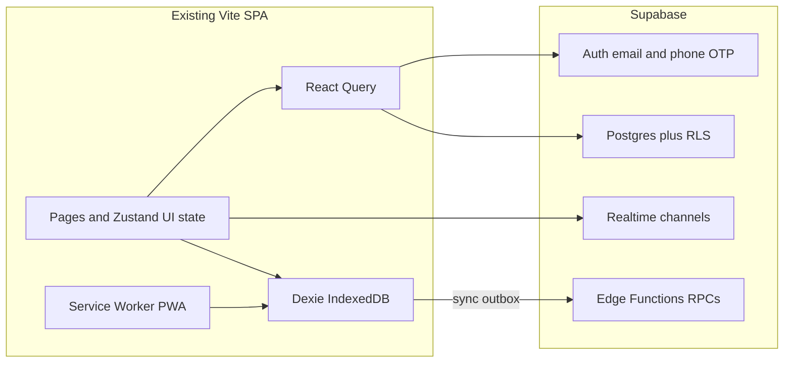
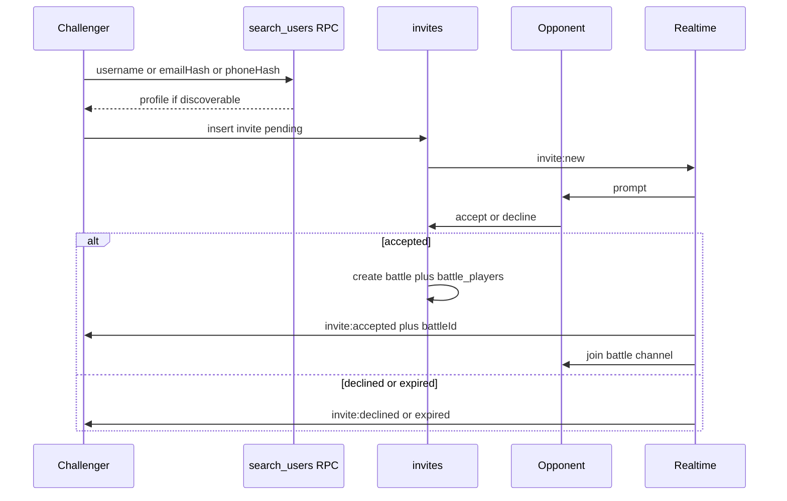

# Battleverse — Technical Requirements Document

**Audience:** engineer implementing against the existing frontend  
**Companion docs:** [PRD.md](./PRD.md), [BUILD_PLAN.md](./BUILD_PLAN.md)  
**Current State appendix:** Section 12 (read the repo; do not assume)

---

## 1. Architecture

Keep the **Vite + React SPA** on Vercel. Add a BaaS backend and an on-device database. Do not rewrite as Next.js.



**Layers**

| Layer | Role |
|-------|------|
| UI | Existing routes and visual system. New screens only where the current UI cannot express the feature (auth, challenge sheet, offline banner, admin, exam picker). |
| Zustand | Ephemeral UI: selected answer, local timer display, Arena Setup chips. Profile XP becomes **optimistic** over server truth. |
| React Query | Server reads/writes. Already mounted in `src/App.tsx` with **zero queries** — this is the intended integration point. |
| Dexie | Offline question packs, attempts, outbox, sync metadata. |
| Service worker | Precache app shell; Background Sync for the outbox. |
| Supabase Auth | Identity. |
| Postgres + RLS | Source of truth for users, questions, battles, XP. |
| Realtime | Presence, invites, battle rooms. |
| Edge Functions | Matchmaking, `submit_answer`, `search_users`, scoring clock — logic that must not trust the client. |

---

## 2. Recommended stack (and why it fits this repo)

| Concern | Choice | Justification vs current code |
|---------|--------|-------------------------------|
| Frontend | Keep Vite 8 + React 19 + TypeScript + React Router 6 | App is a complete SPA (`src/App.tsx`). A Next.js rewrite would throw away the pixel-complete UI for no gain. |
| Styling | Keep Tailwind v4 + shadcn + existing tokens | Do not restyle. New screens reuse `button`, `glass-card`, Nunito. |
| Client cache / server state | **TanStack React Query** (already a dependency `^5.99.0`) | `QueryClientProvider` wraps the tree; start using `useQuery` / `useMutation`. |
| Ephemeral game UI | **Zustand** | `useBattleStore` stays for local timer/selection; `useGameStore` persist becomes a cache, not the ledger. |
| Offline DB | **Dexie (IndexedDB)** | Zustand persist → `localStorage` key `battleverse-game` cannot hold exam packs. |
| PWA | **vite-plugin-pwa** | No service worker exists today. |
| Backend | **Supabase** (Postgres, Auth, Realtime, Storage, Edge Functions) | One vendor for SQL CMS, email/phone auth, and presence. Frontend stays on Vercel (`vercel.json` SPA rewrites). |
| Hosting | Vercel (SPA) + Supabase cloud | Matches current deploy; env vars `VITE_SUPABASE_URL` and `VITE_SUPABASE_ANON_KEY` only on the client. |

**Rejected for this phase (unless you override)**

- **Firebase** — excellent offline SDK, weaker relational CMS for tagged exam items and admin SQL analytics.
- **Custom Node + Socket.io on a VPS** — more ops than a founder+one-engineer team needs before product-market fit.
- **PowerSync / Electric** — better sync later; Dexie + outbox is enough for append-only attempts.

---

## 3. Offline-first strategy

### 3.1 What is cached vs what requires network

**Cached (usable with no internet after a successful sync)**

- Published questions for subjects / exam packs the user has opened or that admin marked `offline_pack = true`.
- User profile display (username, avatar, XP snapshot).
- Local attempts and pending XP events (outbox).
- App shell (JS/CSS) via the service worker.

**Network required**

- Live Battle, matchmaking, presence, sending/accepting invites.
- Admin publish, bulk import, item analytics refresh.
- Authoritative global leaderboard refresh (stale snapshot may show offline with a banner).

**Degrade, do not break**

- Battle/Challenge: existing Arena Setup stays on screen; primary CTA disabled; copy: connection required; optional **queue invite** in outbox.
- Practice: full quiz loop works from Dexie.

### 3.2 Local schema (Dexie)

- `questions` — id, subject, examType, topic, difficulty, ageBand, prompt, options, explanation, `correctIndex` (practice only; see exam mode), `updatedAt`, `packId`.
- `attempts` — clientUuid, questionId, testId, chosenIndex, isCorrect, elapsedMs, createdAt, `syncStatus` (`pending` \| `synced` \| `error`).
- `outbox` — id, type (`attempt` \| `profile_patch` \| `invite_send`), payload JSON, createdAt, retries.
- `meta` — key/value (`lastSyncAt`, `schemaVersion`).

### 3.3 Sync triggers

1. Browser `online` event.
2. App resume / `visibilitychange` → visible.
3. Service worker Background Sync (`sync` tag `battleverse-outbox`) when supported.
4. Manual “Retry sync” on the banner.

### 3.4 Conflict resolution

| Data | Strategy |
|------|----------|
| Attempts / answers | **Append-only.** Client generates UUID. Server `INSERT ... ON CONFLICT (id) DO NOTHING`. Never last-write-wins on an answer. |
| XP / coins / badges | **Server recomputes** from attempts + battle results. Client `addXp` is optimistic; React Query invalidates profile after sync. |
| Profile name / avatar | Last-write-wins using `updated_at`. |
| Question content | Server wins. Dexie replaces rows where `server.updatedAt > local.updatedAt`. Unpublished items are deleted locally. |

**Idempotency:** `completeQuiz` must not fire twice for the same attempt UUID (today `QuizPage.finishQuiz` blindly calls `addXp` — that becomes a mutation keyed by session id).

---

## 4. Real-time architecture

Today `useBattleStore.startSearch` waits 2500ms and invents two bots (`RIVAL_NAMES` + `Math.random() > 0.35`). That function becomes a client orchestrator over server rooms. **Arena Setup UI is unchanged.**

### 4.1 Rooms and the clock

- A battle is a Postgres row `battles` plus Realtime channel `battle:{battleId}`.
- **Server clock.** Edge Function (or a scheduled tick) writes `current_question_id`, `question_started_at`, `duration_ms`. Clients render a timer from `question_started_at` + duration, not from a trusted local 10s countdown (local timer is display-only).
- Clients emit `answer` with `{ battleId, questionId, optionIndex, clientTs }`. Server records first valid answer per player per question, scores, broadcasts `battle:scores`.

Default scoring (preserve current feel):

- Battle: `100 + ceil(secondsLeft * 10)` if correct, else 0 (today in `useBattleStore.submitAnswer`).
- Practice: `10 + floor(timeLeft * 2)` (today in `QuizPage`).

### 4.2 Presence

- Channel `presence:global` or per-user `presence:{userId}` using Supabase Presence.
- States: `online`, `idle`, `in_battle`, `offline` (disconnect).
- Heartbeat ~15s. Used for challenge UI dots and matchmaking eligibility.

### 4.3 Challenge / invite flow



- Search: **exact** username (citext); email/phone hashed (E.164 for phone, lowercase email). No `ILIKE %query%` on children.
- Only rows with `discoverable = true` (and under-13 extra flag) return.
- Matchmaking fallback: `matchmaking_queue` table; Edge Function pairs same `subject` + `age_band` (and optionally exam type); timeout then “waiting” UI — **no silent bots** in ranked mode. (Unranked vs bots can be a later explicit mode.)

### 4.4 Reconnect / disconnect mid-battle

**Default (assumption — see Open Questions):** pause 1v1 for **20 seconds**; if the player does not rejoin the channel, **forfeit**. Remaining player sees the existing results chrome with a “opponent left” state.

- 15s network blip: client resubscribes with JWT; missed events recovered from `battle_events` table (replay).
- Do not bot-fill a ranked match.

### 4.5 Scaling

- One Realtime channel per battle (2–3 players in MVP).
- Target: hundreds of concurrent rooms before dedicated game servers.
- Matchmaking is a short-polling/queue worker, not a hot loop in the browser.
- Do not broadcast `correctIndex` on the wire in exam/battle; clients already have options; server validates.

---

## 5. Data model

Postgres (simplified). UUIDs unless noted. Timestamps `timestamptz`.

### 5.1 Identity

**profiles** (1:1 with `auth.users`)

- `id` (FK auth.users)
- `username` citext unique
- `avatar` text (emoji set from `src/data/gameData.ts` `avatars`)
- `age_band` `6-8` \| `9-12` \| `13-16` \| `16plus`
- `discoverable` boolean default false
- `phone_hash` text null, `email_hash` text null (search only)
- `role` `player` \| `admin`
- `xp`, `coins`, `level` (denormalized; recomputed)
- `parent_email` null (if we add parental gate)
- `updated_at`

### 5.2 Content

**subjects** — seed existing four: `tech`, `ai`, `math`, `general` (ids already used in routes `/quiz/:subjectId`).

**topics** — `id`, `subject_id`, `name`, `exam_type_id` null.

**exam_types** — `casual` \| `jamb` \| `waec` \| `custom`.

**questions**

- `id`, `prompt`, `options` jsonb (length 4), `correct_index` int (0–3)
- `explanation` text
- `subject_id`, `topic_id` null, `exam_type_id`
- `difficulty` `easy` \| `medium` \| `hard` (exists in `Question` today, **unused in selection**)
- `age_band`
- `status` `draft` \| `published` \| `archived`
- `created_by`, `updated_at`

**tests** (custom / exam papers)

- `id`, `title`, `exam_type_id`, `subject_ids` jsonb, `question_count`, `time_limit_s`, `pass_mark_pct`, `hints_allowed` boolean, `offline_pack` boolean, `status`

**test_questions** — `test_id`, `question_id`, `position`.

### 5.3 Play

**attempts** — `id` (client UUID), `user_id`, `question_id`, `test_id` null, `battle_id` null, `chosen_index`, `is_correct`, `elapsed_ms`, `xp_awarded`, `created_at`.

**battles** — `id`, `mode` `matchmaking` \| `challenge`, `subject_id`, `age_band`, `status` `waiting` \| `active` \| `complete` \| `forfeit`, `question_started_at`, `current_index`, `host_clock`.

**battle_players** — `battle_id`, `user_id`, `score`, `connected`.

**battle_questions** — `battle_id`, `question_id`, `position` (server-picked set of 5 to match current Arena).

**invites** — `id`, `from_id`, `to_id`, `subject_id`, `age_band`, `status` `pending` \| `accepted` \| `declined` \| `expired` \| `queued_offline`, `expires_at`.

### 5.4 Gamification

**xp_events** — append-only ledger (`source` practice \| battle \| badge).

**badges** — seed from `src/data/gameData.ts` (`first-win`, `genius`, `math-whiz`, …).

**user_badges** — `user_id`, `badge_id`, `earned_at`. Wire Profile to this; today Profile **hardcodes** unlock flags and ignores `profile.earnedBadges`.

**leaderboard_snapshots** — optional weekly materialization; live view can be `profiles` ordered by `xp` until scale requires snapshots.

**admin_audit** — actor, action, entity, payload.

**Relationships:** User 1—1 Profile; Profile 1—N Attempts, Invites, BattlePlayers; Question N—M Tests; Battle 1—N BattleQuestions, BattlePlayers.

---

## 6. API and realtime contracts

Prefer **Supabase tables + RLS + RPCs** over a custom REST gateway. Grouped by domain.

### 6.1 Auth / identity

- `POST /auth/v1/otp` (Supabase) email or phone.
- `PATCH /rest/v1/profiles` — username, avatar, discoverable (RLS: own row).
- RPC `search_users(query text, kind username|email|phone)` → `{ id, username, avatar, presence }` or empty.

### 6.2 Content (player)

- `GET` published questions by `subject_id` / `test_id` (select **without** `correct_index` for exam/battle; practice may fetch explanation **after** submit via RPC `reveal_explanation`).
- `GET` subjects, tests catalogs.

### 6.3 Practice

- RPC `submit_attempt(attempt jsonb)` — idempotent UUID; returns `{ is_correct, xp, explanation? }`.
- `GET` profile + stats (replaces trusting `completeQuiz` only on the client).

### 6.4 Battle / matchmaking

- RPC `start_matchmaking(subject_id, age_band)` → `{ queueId }` or `{ battleId }`.
- RPC `cancel_matchmaking`.
- RPC `submit_battle_answer(battle_id, question_id, option_index)`.
- Realtime `battle:{id}` events:
  - `battle:question` `{ index, questionId, options, startedAt, durationMs }`
  - `battle:answer_ack` `{ userId, received }`
  - `battle:scores` `{ scores[] }`
  - `battle:complete` `{ ranking }`
  - `battle:forfeit` `{ userId }`

### 6.5 Invites

- `POST` invites; `POST` accept/decline RPCs.
- Realtime `invites:{userId}`: `invite:new`, `invite:accepted`, `invite:declined`, `invite:expired`.

### 6.6 Presence

- Channel presence track `{ userId, username, avatar, status }`.

### 6.7 Admin

- CRUD questions/tests (role `admin` RLS).
- RPC `import_questions(rows jsonb)` — CSV mapped to JSON.
- `GET` item stats: attempts, p(correct), skip/timeout rate.

---

## 7. Auth and identity

| Mechanism | Behavior |
|-----------|----------|
| Email magic link / OTP | Primary. |
| Phone OTP | Optional; used only for login and hashed search. **Never displayed** to other users. |
| Username | Unique, public if discoverable. |
| Guest | Local Dexie + Zustand; no `profiles` row; cannot enter ranked battle or global leaderboard. **Convert:** on first signup, attach outbox attempts to `user_id`. |
| Findable | Username exact if `discoverable`. Email/phone exact hash if opted in. Under-13: `discoverable` default false. |

No Clerk/Firebase Auth in repo today — greenfield Auth via Supabase.

Route guards: `/battle` live start and `/leaderboard` global require session; Practice works as guest.

---

## 8. Admin / CMS requirements

Internal route `/admin` (not a separate app in MVP). Same design tokens; table-heavy is acceptable (shadcn `table`, `dialog` already in `src/components/ui/`).

**Must**

- Question list/filter (exam, subject, topic, difficulty, age band, status).
- Create/edit form matching `Question` fields plus exam type.
- Bulk import: CSV/JSON columns `prompt,option_a,option_b,option_c,option_d,correct_index,explanation,subject,difficulty,age_band,exam_type,topic`.
- Publish / unpublish (draft vs published).
- Custom test builder: pick questions or rules, time limit, pass mark, hints on/off.
- Analytics: per-question attempts, % correct, timeout/skip rate; flag “too easy” (>90% correct, n≥30) and “too hard” (<25% correct, n≥30).

**Must not**

- Redesign the learner quiz UI from the CMS.
- Allow admins to edit another user’s XP by hand without audit log.

---

## 9. Non-functional requirements

| Area | Target |
|------|--------|
| Practice offline | After first pack sync, start a quiz in &lt; 2s on mid-range Android; no network requests required for the 8-question loop. |
| Battle latency | Answer ack p95 &lt; 400ms on decent mobile data. |
| Concurrency | Hundreds of 3-player rooms on Supabase Realtime before re-architecture. |
| Security | RLS on all tables; service role only in Edge Functions; no `correct_index` on client for ranked/exam; anon key is public (expected). |
| Accessibility | New admin and auth flows WCAG AA; keep existing learner contrast. |
| Child safety | See PRD §8; no PII in client analytics events. |
| Hosting | SPA fallback already in `vercel.json`; add env for Supabase; PWA `manifest` + HTTPS. |

---

## 10. Open technical risks and decisions (need a call before or during build)

1. **Backend vendor.** Default: Supabase. Override: Firebase or custom Node.
2. **Under-13 parental email** in MVP vs later. Default: collect age band only; discoverability off; parental email in Should.
3. **Exam explanations.** Default: hide until the test is submitted (no per-item hint). Practice keeps post-answer explanation as today.
4. **Battle reconnect.** Default: pause 20s then forfeit. Alternative: bot-fill (rejected for ranked).
5. **Ranked vs bots.** Default: no bots in live Battle after Phase 3. Keep bots only as an explicit “practice arena” if you want them.
6. **Phone search and NDPR.** Default: opt-in hash lookup only.

Assumptions used throughout this TRD are listed again in Section 13.

---

## 11. Mapping onto existing frontend (do not ignore)

| Existing | Fate |
|----------|------|
| `src/pages/HomePage.tsx` | Keep; later add offline banner + challenge entry. |
| `src/pages/SubjectsPage.tsx` | Wire catalog to React Query + Dexie. |
| `src/pages/QuizPage.tsx` | Replace `getQuestionsBySubject` with cached pack; `finishQuiz` → `submit_attempt` + optimistic Zustand. |
| `src/pages/BattlePage.tsx` | Keep Arena Setup; replace `startSearch` simulation with matchmaking/invite. |
| `src/pages/LeaderboardPage.tsx` | Replace `mockLeaderboard` with server list; keep merge-of-you UI. |
| `src/pages/ProfilePage.tsx` | Wire `setName` / `setAvatar`; badges from `user_badges`. |
| `src/store/gameStore.ts` | Optimistic profile; persist still OK as cache. |
| `src/store/useBattleStore.ts` | Keep shape (`isSearching`, `rivals`, timer); rivals become real `battle_players`. |
| `src/data/quizData.ts` | Seed file for Phase 1; not source of truth after CMS. |
| `src/data/gameData.ts` | Keep level table `getLevel` unless we move thresholds to server (same numbers). |
| `QueryClientProvider` | Start using it. |
| shadcn `form`, `dialog`, `table`, `input-otp` | Auth + admin. |

---

## 12. Appendix — Current State (codebase audit)

Inspected: `/home/pat/repositories/battleverse` (Vite SPA, no backend).

### 12.1 Tech stack (actual)

| Layer | Found |
|-------|--------|
| Build | Vite `^8.0.1`, `@vitejs/plugin-react` |
| UI | React `^19.2.4`, TypeScript `~5.9.3` |
| Routing | `react-router-dom` `^6.30.3` — `BrowserRouter` in `src/App.tsx` |
| State | Zustand `^5.0.12` (`gameStore` persisted, `useBattleStore` in-memory) |
| Server state | `@tanstack/react-query` `^5.99.0` — **provider only, no `useQuery`** |
| Style | Tailwind `^4.2.2`, shadcn `^4.2.0`, `src/index.css` tokens, Framer Motion `^12.38.0` |
| Fonts | Nunito via Google Fonts in `index.html` |
| Hosting | `vercel.json` rewrite `/(.*) → /index.html` |
| Env | **None.** No `import.meta.env`, no `.env.example` |
| Backend | **None.** No `fetch`/WebSocket/Supabase/Firebase/Prisma in `src/` |
| Auth | **None.** Default profile name `"Player"` |
| PWA | **None.** No manifest, no service worker |
| Tests | Placeholder Vitest `src/test/example.test.ts` |

### 12.2 Routes

| Path | Page | Data |
|------|------|------|
| `/` | `HomePage.tsx` | Static subjects + persisted profile stats |
| `/subjects` | `SubjectsPage.tsx` | Static `subjects` |
| `/quiz/:subjectId` | `QuizPage.tsx` | 8 shuffled questions from `quizData.ts`; writes Zustand |
| `/leaderboard` | `LeaderboardPage.tsx` | `mockLeaderboard` + local profile |
| `/profile` | `ProfilePage.tsx` | Zustand stats; **badges hardcoded** |
| `/battle` | `BattlePage.tsx` | Simulated matchmaking + bots |
| `*` | `NotFound.tsx` | Static |

### 12.3 UI-only vs client logic vs missing

**UI-only / mocked:** mock leaderboard names; bot rivals; Profile pencil (no `onClick`); Profile badge `unlocked` flags; Battle copy “Synchronizing Cloud State”; unused `incrementStreak` / `resetStreak`.

**Client-real (local only):** practice 15s timer and XP `10 + floor(timeLeft * 2)`; battle 10s timer and `100 + ceil(timer * 10)`; Zustand persist `localStorage` `battleverse-game`; 32 bundled questions.

**Missing vs PRD:** accounts, RLS, live rooms, invites, presence, Dexie/PWA sync, JAMB/WAEC, admin CMS, legal pages, age gating.

### 12.4 Existing models (to extend, not discard)

```ts
// src/data/quizData.ts
Question { id, question, options[4], correctIndex, explanation, subject, difficulty, ageGroup }
Subject = "tech" | "ai" | "math" | "general"
```

```ts
// src/data/gameData.ts
PlayerProfile { name, avatar, xp, level, coins, streak, earnedBadges, quizzesCompleted, correctAnswers, totalAnswers }
// Levels: 0 Beginner, 100 Learner, 300 Explorer, 600 Challenger, 1000 Pro, 1500 Expert, 2500 Master, 4000 Legend
```

32 questions, 8 per subject. `difficulty` never used in filters. Practice **ignores** `ageGroup`; battle **requires** it (13–16 pool is ~1 question/subject — real battles need a larger bank).

### 12.5 Gaps vs product pillars

1. Kahoot-style live fun — UI yes; rooms/presence/live LB no.
2. Chess.com-style challenge — no search, invite, or presence.
3. Offline-first — accidental (bundled data), not designed (no outbox, no SW).
4. Exam prep — no exam types or custom tests.
5. Admin — no CMS; content is a TypeScript file.

---

## 13. Open Questions appendix (assumptions in force)

| Topic | Assumption unless you override |
|-------|--------------------------------|
| Backend | Supabase + Vercel SPA |
| Market | Nigeria-primary (JAMB/WAEC) + existing casual K-12 subjects |
| Battle product | Keep Arena Setup; no Coming Soon |
| Reconnect | Pause 20s, then forfeit |
| Bots | Removed from ranked live Battle |
| Parental email | Not required in MVP |
| Exam hints | Off until paper submitted |
| Guest | Practice yes; ranked Battle/LB no |

Do not start application code until Phase 1 of the build plan is explicitly requested.
